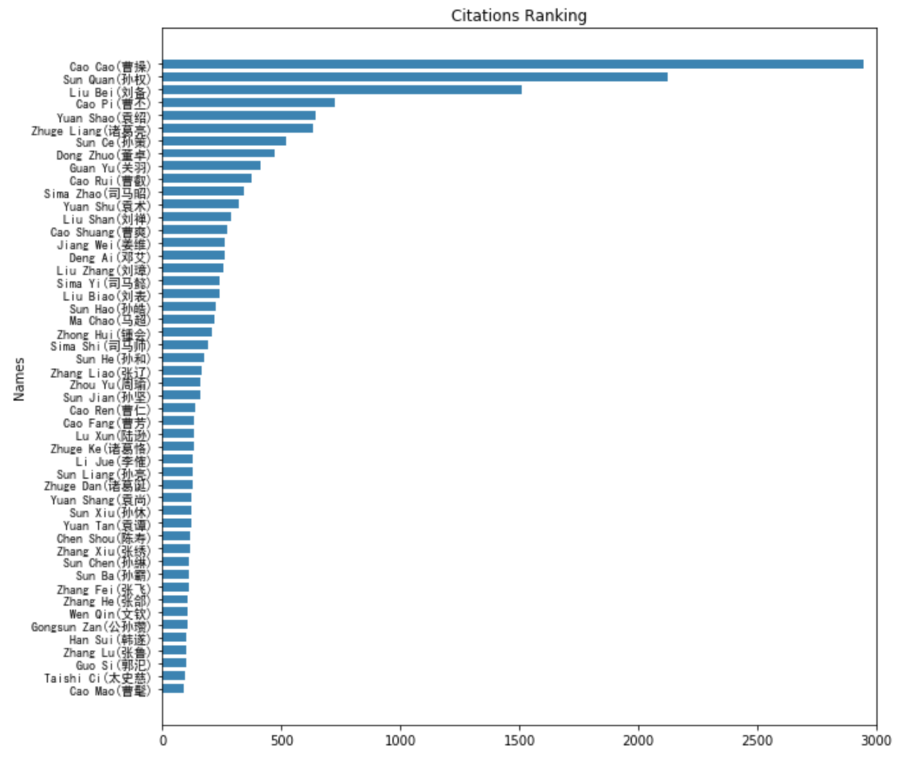
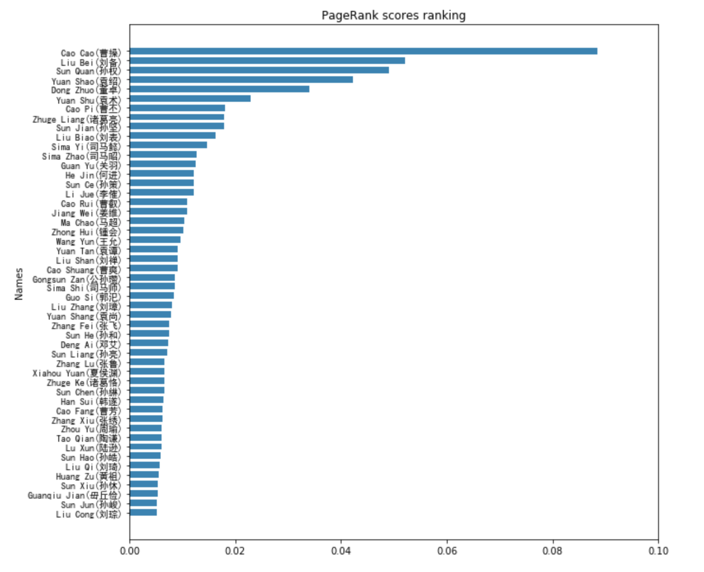
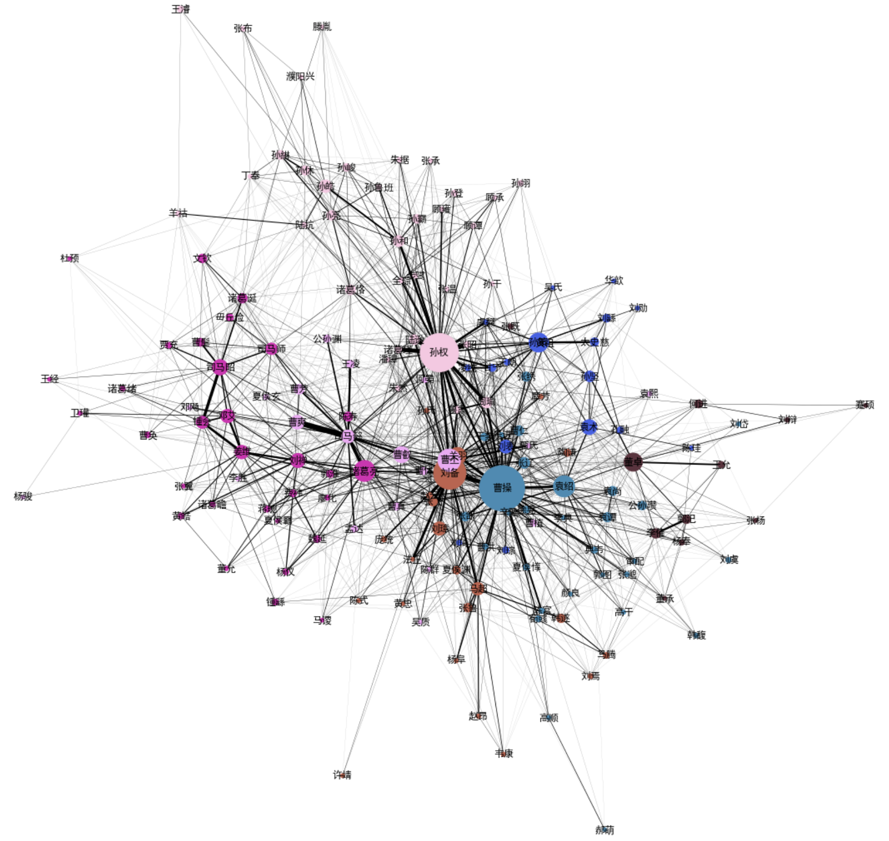
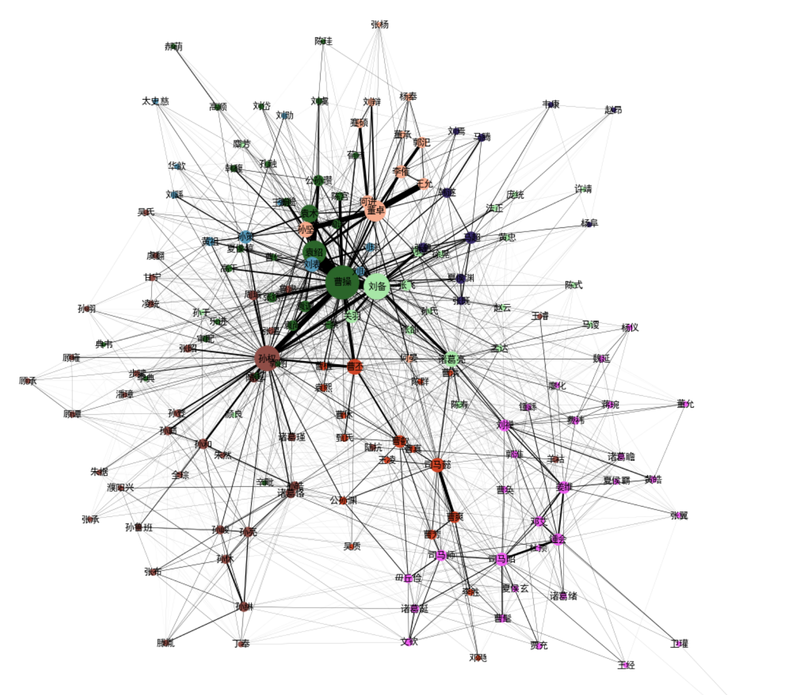

# Three Kingdoms: A Social Network Analysis

- [Three Kingdoms: A Social Network Analysis](#three-kingdoms-a-social-network-analysis)
  - [About This Project](#about-this-project)
  - [Data Visualizations](#data-visualizations)
    - [Citations](#citations)
    - [PageRank](#pagerank)
    - [Community Detection](#community-detection)

## About This Project

This is a social network analysis on the historical figures of the end of the Eastern Han Dynasty (189-220 AD) and Three Kingdoms (220-280 AD). Data are scraped from English Wikipedia entries of these people.

## Data Visualizations

### Citations

The *citations* of a person here is defined as the total number of his/her occurrence in all other people's entries.

- Citations of the highest 50 people

### PageRank

- PageRank scores of the highest 50 people

### Community Detection

- Social graph based on citations

- Social graph based on PageRank scores

